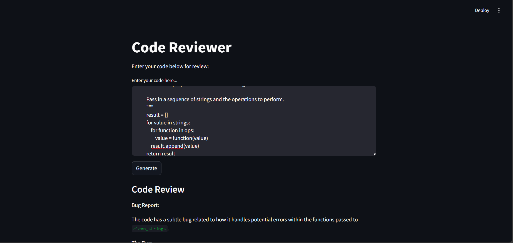

# program-Reviewer

A simple web-based application that reviews Python code for potential bugs using **Google Generative AI** and **Streamlit**.

This tool provides an automated way to analyze your code, generate insights, and identify bugs using state-of-the-art AI models.

---

## Features

- **Python Code Analysis**: Input Python code and get a detailed review with potential bug reports.
- **Streamlit Interface**: Easy-to-use and interactive user interface.
- **Google Generative AI Integration**: Uses the `gemini-1.5-flash` model to provide intelligent code review.

---

## Prerequisites

### 1. API Key

To use this app, you'll need access to the **Google Generative AI API**. Obtain an API key and set it as an environment variable:

```bash
genai.configure(api_key="your_api_key_here")
```

---

### 2. Install Dependencies
Ensure you have Python 3.7 or higher installed.

Install the required dependencies with:

```bash
pip install -r requirements.txt
```

---

### 3. Run the Streamlit app

```bash
streamlit run app.py
```
---

### 4. OUTPUT



---

### 5 OUTPUT DEMO

<video controls src="project/Recording 2024-12-06 152320.mp4" title="demo"></video>